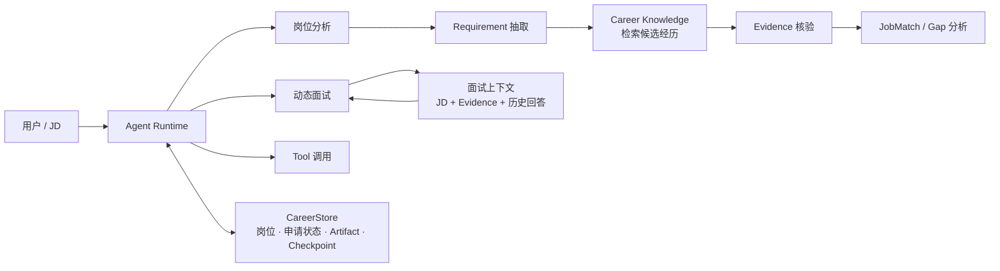

# 🧠 Job Agent：长期求职智能体与证据约束工作台

> 面向长期求职流程的个人 Agent 系统：让大模型负责理解、比较与决策，让程序负责证据、权限、状态、副作用与失败恢复。

这个项目最初只是一个用于分析 JD 和准备面试的工具，后来逐步演化成一个更完整的长期求职工作台。  
目前重点不再是“让模型多做几个功能”，而是解决三个更实际的问题：

- **语义相关不等于事实支持**：检索到相似经历，并不代表候选人真的满足岗位要求；
- **长期任务不能只靠上下文窗口**：岗位、申请阶段、分析结果和面试记录需要持久化、可恢复、可审计；
- **子模块高分不代表完整系统可靠**：需求抽取、检索、证据核验和最终匹配必须分层评测，才能知道错误真正发生在哪里。

因此，项目把 **LLM 的开放语义能力** 与 **Python 的确定性执行职责** 明确分开，并围绕四条主线持续迭代：

**受控 Agent Runtime｜长期状态管理｜Evidence Grounding｜分层评测与错误归因**

---

## ✨ 核心能力

### 🤖 受控 Agent Runtime

自研轻量 `AgentLoop`，把模型每轮决策限制为：

```text
Finish / InputRequest / Action
```

模型可以决定“做什么”，但不能直接修改业务状态。所有 Tool Action 都必须经过运行时统一处理：

- Tool Registry 与输入输出 Schema
- Tool / Skill / Runtime Policy 多层权限约束
- Approval 与调用预算
- Tool Executor 与结构化 Observation
- 独立 Verifier
- Checkpoint / Resume
- 原子状态提交与失败保护

对于非幂等操作，如果发生“Tool 已执行，但 receipt 尚未可靠落库”的崩溃窗口，系统不会盲目重试，而是进入 `UNCERTAIN`，等待人工核对外部副作用。

---

### 🔎 检索与证据核验

项目刻意把“**检索相关性**”和“**事实支持关系**”拆成两件事。

当前主链路为：

```text
JD
→ 岗位要求抽取
→ 原子要求
→ 候选经历召回
→ 逐条 Evidence 判定
→ 确定性聚合
→ JobMatch / Gap
```

其中：

- 使用 `Qwen3-Embedding-0.6B + FAISS` 召回候选经历；
- 岗位要求先拆成原子要求，避免一个复合 requirement 同时混入多个判断；
- LLM 只负责生成语义候选与判定；
- 原文定位、hash、provenance 上限、派生状态与最终聚合由 Python 计算；
- quote 无法唯一定位、source 不存在、snapshot 过期或来源等级越界时直接 fail closed。

这样做的目标不是让模型“看起来更聪明”，而是让最终结论能够回到候选人的原始经历，并明确区分：

> **“内容很像”** 和 **“它真的能支持这个岗位要求”**

---

### 💾 长期状态与可恢复执行

项目使用 `SQLite CareerStore` 管理长期求职状态，包括：

- 公司与岗位
- 申请阶段与阶段事件
- 分析结果与 artifact 链接
- 面试记录索引
- legacy session / tracker 迁移审计

阶段变化采用 append-only event 记录，并在同一 transaction 内更新当前状态。  
历史数据迁移采用 source hash 去重，不覆盖、不删除旧数据；无法可靠归属的记录进入待整理队列，而不是静默猜测。

异步 Backend 进一步验证了：

- PostgreSQL 状态权威
- transactional Outbox
- Redis Streams 唤醒
- Worker lease / heartbeat / fencing
- Checkpoint Adapter
- Tool operation ledger
- Provider 限流、熔断与故障恢复

这部分定位为 **Agent Backend 的可靠性学习与验证路径**，不宣称已经达到生产级多租户 SaaS。

---

### 🎤 动态模拟面试

动态面试不是固定题库轮播，而是根据冻结的岗位与候选人上下文逐轮决策。

Interviewer 每轮只能选择一个动作：

```text
追问 / 切换主题 / 只读检索 / 结束
```

输入可以来自：

- JD requirements 与 Evidence
- 候选人的 Project Dossier
- 公开基础题 anchor
- 受 allowlist、budget 与 timeout 约束的只读 repository/source Tool

每次回答都会成为下一轮 observation。  
Transcript 与最终 debrief 只消费上游 Evidence，不反向修改 Evidence，避免模拟面试中的内容污染事实层。

---

## 🏗️ 系统架构

为了避免把内部实现细节全塞进一张图，这里只保留项目最核心的业务关系：



这张图只表达三个核心关系：

- **Agent Runtime** 负责统一控制模型决策、Tool 调用、权限与状态提交；
- **岗位分析链路** 将 JD 拆成 requirement，经检索与 Evidence 核验后得到 JobMatch / Gap；
- **CareerStore** 保存长期状态和 Checkpoint，让岗位分析、申请跟踪与动态面试可以跨会话继续。

更细的 Tool Policy、Verifier、PostgreSQL / Redis、Worker、Outbox 与故障恢复实现放在 `docs/` 中，不在 README 首页展开。

## 📊 评测结果

项目把 **工程合同、模型行为、Evidence 子系统和完整业务链路** 分开报告。

### 🧪 真实 JD 未见留出集

最新一轮使用：

- **17 份**此前未参与调优的真实 JD
- **51 个**父级要求
- **101 个**原子要求
- **42 个**有证据要求
- **59 个**真实证据缺口

评测前先冻结人工 Gold；模型运行后不修改标注，也不针对该 holdout 继续调参。

| 指标                                                         |       结果 |
| ------------------------------------------------------------ | ---------: |
| 原子 Evidence Accuracy                                       | **93.07%** |
| Supported Precision                                          | **97.30%** |
| 有证据要求 Recall@3                                          |   **100%** |
| 有证据要求 Recall@5                                          |   **100%** |
| 59 个真实证据缺口中的错误支持                                |   **1 次** |
| 父级 requirement 状态准确率                                  | **90.20%** |
| Positive / Gap Accuracy                                      | **94.12%** |
| Raw JD → Requirement → Evidence → JobMatch 完整链路 strength/gap correctness | **50.98%** |

这组结果说明：

- **Retrieval / Evidence 层已经在 unseen 真实 JD 上表现稳定；**
- 完整链路仍会受到 requirement miss 与下游 semantic error 影响；
- 因此不会把 `93.07% Evidence Accuracy` 描述成“端到端准确率 93%”。

`50.98%` 被保留为完整链路的当前基线，而不是在看过 holdout 结果后继续针对性调参。

---

### 🧩 Agent 与可靠性评测

项目还保留独立的 Agent / Backend 评测，用来回答不同问题：

- Stateful Agent acceptance cases：工具选择、授权、跨轮指代、状态修改与恢复
- Application Assistant：Approval、Checkpoint Resume、Grounding、重复副作用与 `UNCERTAIN`
- Fault Injection：PostgreSQL、Redis、Worker、Provider、Queue 等故障路径
- Mock 与真实 Provider 结果分开报告，不把 Mock 延迟或工程回归解释为真实模型性能

当前公开文档中，Application Assistant 的 24 条确定性场景全部通过；其意义是验证 Runtime 合同与恢复路径，不代表开放输入下真实模型同样达到 100%。

详细评测口径见 [`docs/evaluation.md`](docs/evaluation.md)。

---

## 🧩 主要模块

| 模块                  | 主要职责                                                     |
| --------------------- | ------------------------------------------------------------ |
| `AgentLoop / Runtime` | 模型决策、Tool 路由、权限、审批、预算、Verifier、Checkpoint  |
| `Career Knowledge`    | 候选人经历索引、检索、source snapshot 与 provenance          |
| `Evidence Pipeline`   | Requirement → Retrieval → Evidence → Aggregation             |
| `CareerStore`         | 公司、岗位、申请阶段、artifact 链接与迁移审计                |
| `Adaptive Interview`  | 基于 JD、Evidence、Project Dossier 与历史回答动态追问        |
| `Evaluation Harness`  | 冻结数据、分层指标、未见留出集、错误切片与 failure attribution |
| `Backend Service`     | 异步 Run、PostgreSQL / Redis、Worker、lease / fencing 与故障恢复 |

---

## 🧰 技术栈

`Python` · `Pydantic` · `LangGraph` · `FastAPI`  
`Qwen3-Embedding` · `FAISS` · `BM25` · `RRF`  
`SQLite` · `PostgreSQL` · `Redis Streams`  
`Pytest` · `Docker Compose` · `Locust`

---

## 📁 仓库结构

```text
.
├── src/job_agent/          # Agent Runtime、CareerStore、Interview、Backend
├── fit_verdict_engine/     # Evidence / Fit 相关组件
├── tests/                  # 合同测试、集成测试与回归测试
├── docs/                   # 架构、评测、边界与实验记录
├── scripts/                # 评测、迁移与实验脚本
├── load_tests/             # Backend 负载与故障实验
├── data/                   # 可公开 / 脱敏数据
└── demo/                   # Demo 资源
```

---

## 🚀 快速开始

要求 **Python 3.10+**。

```bash
git clone https://github.com/lhuowang681-cpu/agent-backend-service.git
cd agent-backend-service

python -m pip install -e ".[ui,dev]"
python -m pytest -q
```

启动本地工作台：

```bash
streamlit run src/job_agent/ui/app.py
```

实时模型调用需要在进程环境中配置对应凭据和允许的 Skill 包。  
API Key、真实简历、SQLite、Checkpoint、日志与原始模型响应都不应提交到仓库。

异步 Backend、Docker Compose、故障注入和压测的启动方式请查看 `docs/` 中对应文档，而不是在 README 首页展开全部运维细节。

---

## 📚 文档导航

- 🏗️ [`docs/architecture.md`](docs/architecture.md)：系统架构与责任边界
- 🧪 [`docs/evaluation.md`](docs/evaluation.md)：评测分层、指标定义与历史结果
- 🛡️ [`docs/security-boundaries.md`](docs/security-boundaries.md)：安全与公开边界
- 📌 [`docs/evidence/current_status.md`](docs/evidence/current_status.md)：当前实现事实与已知限制
- 📂 [`docs/evidence/`](docs/evidence/)：阶段实验、审计与验证记录
- ⚙️ [`docs/tech-specs/`](docs/tech-specs/)：设计方案与实现计划
- 📈 [`docs/performance/`](docs/performance/)：Backend 负载、扩容与故障矩阵

---

## ⚠️ 能力边界

这个仓库是一个 **Agent 工程与评测项目**，不是生产招聘平台。

当前不会宣称：

- 测试通过率等于真实模型语义准确率；
- Evidence 子系统指标等于完整端到端表现；
- Mock Provider 结果等于真实 Provider 质量；
- Backend 压测结果构成生产 SLA；
- 已实现生产身份系统、共享多租户 CareerStore 或任意第三方系统 exactly-once；
- 系统可以安全地自动投递、发送真实邮件或执行不受控外部写操作；
- JobMatch 分数等同于真实录用概率。

项目更关注的是：**把哪些能力已经验证、哪些仍未证明，说清楚。**

---

## 🗺️ 当前重点

- 提高真实 JD 上的 Requirement Extraction recall
- 降低完整 JobMatch 链路中的 downstream semantic error
- 在不牺牲 Supported Precision 的前提下提高端到端 correctness
- 继续使用冻结数据与未见留出集评测，而不是在 holdout 上反复调参
- 将评测、失败恢复和 Evidence contract 保持为系统的一等能力

---

## 📄 License

MIT License
