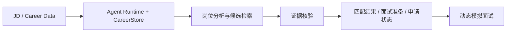

# 🧠 Job Agent：长期求职智能体与证据约束工作台

> 面向长期求职流程的个人 Agent 系统，覆盖岗位分析、候选经历检索、证据核验、申请状态管理和动态模拟面试。

Job Agent 主要解决三类问题：

- **岗位要求与个人经历难以可靠对应**：通过原子化要求、候选检索和逐条证据核验，减少语义相似带来的误匹配；
- **长期求职信息容易散落在不同会话中**：通过持久化状态、Checkpoint 和阶段事件记录，让岗位、申请进度和面试准备可以跨会话延续；
- **Agent 出错后难以定位原因**：把需求抽取、检索、证据判断、聚合和最终匹配拆开评测，保留每一层的错误归因。

项目目前围绕四条主线持续迭代：

**受控 Agent Runtime｜长期状态管理｜证据核验｜分层评测与错误归因**

---

## ✨ 核心能力

### 🤖 受控 Agent Runtime

为了让 Agent 在长期任务中保持可控、可恢复，自研轻量 `AgentLoop`，将模型每轮决策约束为：

```text
Finish / InputRequest / Action
```

模型负责生成下一步动作，Runtime 负责执行约束和状态提交。当前已经实现：

- Tool Registry 与输入输出 Schema
- Tool / Skill / Runtime Policy 多层权限控制
- Approval 与调用预算
- Tool Executor 与结构化 Observation
- 独立 Verifier
- Checkpoint / Resume
- 原子状态提交与失败保护

对于非幂等操作，系统会记录 Tool 执行状态和 receipt。发生执行结果不确定的崩溃窗口时，任务进入 `UNCERTAIN`，等待进一步核对，避免重复触发外部副作用。

---

### 🔎 检索与证据核验

为了把岗位要求和候选人真实经历可靠对应，当前使用下面的处理链路：

```text
JD
→ 岗位要求抽取
→ 原子要求
→ 候选经历召回
→ 逐条证据判定
→ 确定性聚合
→ 匹配结果 / 能力缺口
```

主要实现包括：

- 使用 `Qwen3-Embedding-0.6B + FAISS` 召回候选经历；
- 将复合岗位要求拆成原子要求，降低多个条件混在一次判断中的歧义；
- 对每个原子要求单独生成候选证据并判断支持关系；
- 使用原文 span、hash 和 provenance 保留证据来源；
- 由 Python 完成证据等级上限、派生状态和最终聚合；
- quote 无法唯一定位、source 不存在、snapshot 失效或来源等级不满足约束时终止该条证据写入。

最终每个匹配结论都可以回溯到候选人的原始经历，方便后续生成简历、准备面试和分析能力缺口。

---

### 💾 长期状态与可恢复执行

为了支持跨会话、跨进程的长期求职流程，使用 `SQLite CareerStore` 管理：

- 公司与岗位
- 申请阶段与阶段事件
- 分析结果与 artifact 链接
- 面试记录索引
- 历史 session / tracker 迁移信息

申请阶段采用 append-only event 记录，并在同一 transaction 内更新当前状态。历史数据迁移使用 source hash 去重，无法可靠归属的记录进入待整理队列。

在异步 Backend 路径中，还实现并验证了：

- PostgreSQL 状态存储
- Transactional Outbox
- Redis Streams 唤醒
- Worker lease / heartbeat / fencing
- Checkpoint Adapter
- Tool operation ledger
- Provider 限流、熔断与故障恢复

这些组件用于验证长任务、审批暂停、Worker 重启和重复投递场景下的恢复行为。

---

### 🎤 动态模拟面试

为了让模拟面试能够根据回答继续追问，而不是按固定题库顺序执行，Interviewer 每轮根据当前上下文选择一个动作：

```text
追问 / 切换主题 / 只读检索 / 结束
```

面试上下文由以下信息组成：

- JD 要求与已核验 Evidence
- 候选人的 Project Dossier
- 公开基础题 anchor
- 受 allowlist、budget 和 timeout 约束的只读 repository / source Tool
- 历史回答与当前轮次状态

每次回答都会成为下一轮输入。Transcript 和最终 debrief 使用已经生成的 Evidence 与面试轨迹，支持后续复盘和针对性准备。

---

## 🏗️ 系统架构

README 只保留最核心的业务链路，内部权限、Worker、Redis、Outbox 等实现细节放在 `docs/` 中。



主链路可以概括为：

**输入求职信息 → Agent 统一调度与持久化 → 岗位分析和检索 → 证据核验 → 生成求职状态与准备材料 → 动态面试**

详细职责边界见 [`docs/architecture.md`](docs/architecture.md)。

---

## 📊 评测结果

评测按照 **需求抽取、检索、证据核验、父级聚合和最终匹配** 分层进行，同时保留完整链路结果。

### 🧪 真实 JD 未见留出集

最新一轮使用：

- **17 份**此前未参与调优的真实 JD
- **51 个**父级要求
- **101 个**原子要求
- **42 个**有证据要求
- **59 个**真实证据缺口

人工 Gold 在模型运行前冻结，运行结束后未修改标注。

| 指标                                                         |       结果 |
| ------------------------------------------------------------ | ---------: |
| 原子 Evidence Accuracy                                       | **93.07%** |
| Supported Precision                                          | **97.30%** |
| 有证据要求 Recall@3                                          |   **100%** |
| 有证据要求 Recall@5                                          |   **100%** |
| 59 个真实证据缺口中的错误支持                                |   **1 次** |
| 父级要求状态准确率                                           | **90.20%** |
| Positive / Gap Accuracy                                      | **94.12%** |
| Raw JD → Requirement → Evidence → JobMatch 完整链路 strength/gap correctness | **50.98%** |

这轮结果带来了两个直接结论：

- Retrieval / Evidence 层在未见真实 JD 上保持了较高的召回和支持精度；
- 完整链路当前的主要损失来自 Requirement miss 和下游 semantic error。

`50.98%` 的完整链路结果作为下一阶段优化基线，后续重点放在需求抽取召回和下游语义判断上。

---

### 🧩 Agent 与可靠性评测

除了 Evidence 链路，还维护独立的 Agent / Backend 测试，用于验证执行约束和恢复能力：

- Stateful Agent acceptance cases：工具选择、授权、跨轮指代、状态修改与恢复；
- Application Assistant：Approval、Checkpoint Resume、Grounding、重复副作用与 `UNCERTAIN`；
- Fault Injection：PostgreSQL、Redis、Worker、Provider、Queue 等故障路径；
- Mock Provider 与真实 Provider 分开记录，分别用于工程回归和模型行为评测。

当前公开文档中的 Application Assistant 24 条确定性场景全部通过，覆盖 Runtime 合同、审批、恢复与重复副作用处理。

详细评测口径见 [`docs/evaluation.md`](docs/evaluation.md)。

---

## 🧩 主要模块

| 模块                  | 主要职责                                                     |
| --------------------- | ------------------------------------------------------------ |
| `AgentLoop / Runtime` | 模型决策、Tool 路由、权限、审批、预算、Verifier、Checkpoint  |
| `Career Knowledge`    | 候选人经历索引、检索、source snapshot 与 provenance          |
| `Evidence Pipeline`   | Requirement → Retrieval → Evidence → Aggregation             |
| `CareerStore`         | 公司、岗位、申请阶段、artifact 链接与迁移审计                |
| `Adaptive Interview`  | 基于 JD、Evidence、Project Dossier 与历史回答动态追问        |
| `Evaluation Harness`  | 冻结数据、分层指标、未见留出集、错误切片与 failure attribution |
| `Backend Service`     | 异步 Run、PostgreSQL / Redis、Worker、lease / fencing 与故障恢复 |

---

## 🧰 技术栈

`Python` · `Pydantic` · `LangGraph` · `FastAPI`  
`Qwen3-Embedding` · `FAISS` · `BM25` · `RRF`  
`SQLite` · `PostgreSQL` · `Redis Streams`  
`Pytest` · `Docker Compose` · `Locust`

---

## 📁 仓库结构

```text
.
├── src/job_agent/          # Agent Runtime、CareerStore、Interview、Backend
├── fit_verdict_engine/     # Evidence / Fit 相关组件
├── tests/                  # 合同测试、集成测试与回归测试
├── docs/                   # 架构、评测、边界与实验记录
├── scripts/                # 评测、迁移与实验脚本
├── load_tests/             # Backend 负载与故障实验
├── data/                   # 可公开 / 脱敏数据
└── demo/                   # Demo 资源
```

---

## 🚀 快速开始

要求 **Python 3.10+**。

```bash
git clone https://github.com/lhuowang681-cpu/agent-backend-service.git
cd agent-backend-service

python -m pip install -e ".[ui,dev]"
python -m pytest -q
```

启动本地工作台：

```bash
streamlit run src/job_agent/ui/app.py
```

实时模型调用需要在进程环境中配置对应凭据和允许的 Skill 包。  
API Key、真实简历、SQLite、Checkpoint、日志与原始模型响应默认保存在本地环境。

异步 Backend、Docker Compose、故障注入和压测的启动方式见 `docs/` 中对应文档。

---

## 📚 文档导航

- 🏗️ [`docs/architecture.md`](docs/architecture.md)：系统架构与责任边界
- 🧪 [`docs/evaluation.md`](docs/evaluation.md)：评测分层、指标定义与历史结果
- 🛡️ [`docs/security-boundaries.md`](docs/security-boundaries.md)：安全与公开边界
- 📌 [`docs/evidence/current_status.md`](docs/evidence/current_status.md)：当前实现事实与已知限制
- 📂 [`docs/evidence/`](docs/evidence/)：阶段实验、审计与验证记录
- ⚙️ [`docs/tech-specs/`](docs/tech-specs/)：设计方案与实现计划
- 📈 [`docs/performance/`](docs/performance/)：Backend 负载、扩容与故障矩阵

---

## 📌 当前实现范围

当前版本已经覆盖：

- 单用户长期求职状态管理
- 岗位分析与 Evidence Grounding
- 动态模拟面试
- Tool 权限、审批、Checkpoint 与失败恢复
- 真实 JD 未见留出集评测
- Backend 异步执行、Worker 恢复与故障注入实验

后续工程化方向包括多租户身份系统、更多真实外部系统接入和更完整的端到端自动化流程。

---

## 🗺️ 当前重点

- 提高真实 JD 上的 Requirement Extraction recall
- 降低完整 JobMatch 链路中的 downstream semantic error
- 在保持 Supported Precision 的同时提高端到端 correctness
- 持续扩展冻结数据与未见留出集
- 完善评测、失败恢复和 Evidence contract

---

## 📄 License

MIT License
