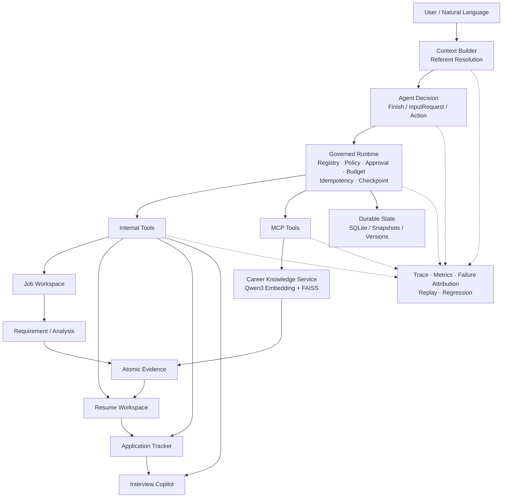

# Stateful Job Agent

A stateful, evidence-grounded job-search agent for long-horizon career workflows.

Stateful Job Agent 面向真实求职流程，围绕岗位管理、JD 分析、候选人经历核验、简历定制、投递跟踪和面试准备构建长期 Agent 工作流。系统将 LLM 的语义判断与确定性运行时、持久化状态、证据追溯和评测体系结合，使多轮任务可以跨会话恢复，关键结论可以追溯到原始材料，状态修改可以被治理和审计。

## Overview

项目主流程覆盖：

```text
Real Job Sources
      ↓
Job Workspace
      ↓
JD / Requirement Analysis
      ↓
Atomic Evidence Grounding
      ↓
Grounded Resume Tailoring
      ↓
Application Lifecycle
      ↓
Stateful Interview Copilot
```

底层由统一的 Agent Runtime 驱动：

```text
Natural Language
      ↓
Context / Referent Resolution
      ↓
Agent Decision
      ↓
Governed Runtime
      ↓
Internal Tools / MCP Tools
      ↓
Durable State
```

同时提供 Trace、Failure Attribution、Replay 与 Evaluation，用于观察和回归完整 Agent trajectory。

### Current scale

- **197** 个真实岗位
- **200** 个 JD 版本
- 数据来源：**Greenhouse / Ashby / Lever**
- 覆盖 **9** 类岗位方向
- **17** 个全新真实 JD 的 unseen holdout
- **101** 个 atomic requirements
- Job / Evidence / Resume / Application / Interview 五类业务流统一接入 Trace & Replay

---

## Core Capabilities

### 1. Stateful Agent Runtime

项目实现了 bounded `AgentLoop`，模型每一步输出统一为：

```text
Finish
InputRequest
Action
```

Runtime 负责工具注册、参数校验、权限策略、副作用控制和状态提交。

主要能力：

- Dynamic Tool Registry
- Pydantic structured contracts
- Context Projection
- Referent Resolution
- Policy / Approval
- Step Budget
- Checkpoint / Resume
- Idempotent side effects
- Timeout / Retry
- Structured Observation
- DeepSeek API / Local Qwen / Mock providers
- Cross-session state recovery

在 Stateful Agent acceptance 中，DeepSeek 的 11 个核心场景在 task correctness、constraint compliance、capability selection、argument correctness、referent、clarification、governance、state mutation、cross-session 和 grounding 上均通过。

---

### 2. Durable Job Workspace

Job Workspace 用于长期维护岗位池，而不是只处理单次 JD 输入。

支持：

- 真实 JD 批量导入
- Source ID / URL / content hash 分层去重
- Near-duplicate review
- Immutable JD versioning
- Analysis freshness 管理
- Structured search / filter
- Batch analysis 与中断恢复
- Job comparison
- Common strength / gap aggregation
- Shortlist / Archive
- Job → Application handoff
- Process restart persistence

当前岗位数据：

| Source     |    Jobs |
| ---------- | ------: |
| Greenhouse |     110 |
| Ashby      |      57 |
| Lever      |      30 |
| **Total**  | **197** |

系统保留 Job 与 Application 两套不同的业务状态：Job Workspace 管理岗位发现、分析和筛选；Application lifecycle 管理实际投递后的状态变化。

---

### 3. Durable Career Knowledge

Career Knowledge Service 使用 **Qwen3-Embedding-0.6B + FAISS** 构建候选人个人材料检索层，并通过 MCP 接入 Agent Runtime。

支持：

- SQLite document repository
- Immutable document versions
- Deterministic chunk identity
- Canonical text normalization
- Content hash / exact offsets
- Persistent FAISS save / load / rebuild
- Corpus version
- Index manifest
- Embedding model identity / dimension compatibility check
- Add / Update / Delete / NOOP ingestion
- Historical provenance resolution
- TXT / Markdown / PDF / DOCX text ingestion

个人 Career Knowledge 与 Job/JD corpus 使用独立的数据范围，避免职位描述进入候选人经历证据链。

---

### 4. Atomic Evidence Grounding

岗位分析将 JD requirement 拆分为可独立验证的 atomic requirements，并在候选人材料中寻找直接支持证据。

```text
JD Requirement
      ↓
Atomic Requirements
      ↓
Candidate Retrieval
      ↓
Pairwise Entailment
      ↓
SourceSpan
      ↓
Provenance Policy
      ↓
Parent Aggregation
```

LLM 负责 atomic requirement 与候选材料之间的语义判断；程序负责：

- requirement / atom identity
- chunk identity
- exact quote validation
- SourceSpan offsets
- document hash / version
- provenance level
- parent status aggregation

`SUPPORTED / PARTIAL / GAP` 的父级结果由 atom 支持情况确定性聚合。

#### Unseen holdout

在 **17 个未参与开发调优的真实 JD、101 个 atomic requirements** 上：

| Metric                      |     Result |
| --------------------------- | ---------: |
| Atomic Evidence Accuracy    | **93.07%** |
| Supported Precision         | **97.30%** |
| Supported Recall            | **85.71%** |
| Unsupported Recall          | **98.31%** |
| Positive Retrieval Recall@3 |   **100%** |
| Positive Retrieval Recall@5 |   **100%** |
| Parent Requirement Accuracy | **90.20%** |
| Positive / Gap Accuracy     | **94.12%** |
| Quote Validity              |   **100%** |
| Provenance Validity         |   **100%** |

59 个 gap atoms 中出现 1 个 false support。

完整 Raw-JD → JobMatch 流程在同一 holdout 上的 strength/gap correctness 为 **50.98%**，主要误差来自 requirement extraction 与端到端 evidence status 传播。项目因此保留 subsystem 与 end-to-end 两套评测口径。

---

### 5. Grounded Resume Tailoring

Resume Workspace 将简历表示为版本化结构：

```text
Resume
  └─ ResumeVersion
      ├─ Section
      ├─ Bullet
      └─ Claim
```

针对目标 Job，系统先计算 requirement 与现有简历内容的覆盖关系，再生成 Tailoring Plan 和 grounded rewrite。

```text
Job Requirements
      ↓
Candidate Evidence
      ↓
Resume Coverage
      ↓
Tailoring Plan
      ↓
Grounded Rewrite
      ↓
Claim Verification
      ↓
User Approval
      ↓
Immutable Resume Version
```

支持：

- Structured Resume / Version / Section / Bullet / Claim
- Claim audit
- Requirement → Resume coverage
- Supported-but-missing capability detection
- Evidence-grounded rewrite
- Numeric claim verification
- Technology claim verification
- Responsibility / scope verification
- Partial approval
- Structured diff
- JD update → resume stale
- Exact ResumeVersion → Application linkage
- `PUBLIC / RESUME_SAFE / PRIVATE_ONLY / ANONYMIZED_ONLY` disclosure policy

#### Tailoring evaluation

在 24 个真实岗位的 Resume Tailoring Eval 中：

| Method                      | Unsupported Claim Rate | False Experience | Numeric Fabrication | Gap Laundering |
| --------------------------- | ---------------------: | ---------------: | ------------------: | -------------: |
| Generic LLM                 |                 58.33% |                2 |                   1 |             11 |
| Evidence Grounded           |                  8.33% |                2 |                   0 |              0 |
| **Grounded + Verification** |                 **0%** |            **0** |               **0** |          **0** |

Claim Verification 还会拒绝无证据的责任范围膨胀，例如将“实现/参与”改写成“主导”“生产环境落地”等。

---

### 6. Application Lifecycle

ApplicationTracker 管理真实投递后的业务状态，并与 Job Workspace、Resume Workspace 保持引用关系。

支持：

- Explicit stage transition
- ResumeVersion linkage
- Next Action
- Idempotent mutation
- Approval-controlled updates
- OA / Resume Screen / Interview / Offer / Rejected / Withdrawn 等状态
- Event history
- Cross-process persistence

一个 Application 固定引用具体 ResumeVersion，后续简历更新不会修改历史投递记录。

---

### 7. Stateful Interview Copilot

Interview Copilot 将岗位要求、当前投递简历、项目证据和历史面试表现组合成持久化面试工作流。

```text
Application
   ↓
Interview Round
   ↓
Prep Snapshot
   ↓
Mock Interview Session
   ↓
Answer Evaluation
   ↓
Follow-up
   ↓
Weakness State
   ↓
Review Queue
```

支持：

- Job-specific questions
- Resume / project deep-dive
- Technical review
- Gap review
- Durable InterviewRound
- Prep snapshots
- Mock sessions
- Structured answer evaluation
- Expected-point coverage
- Unsupported personal claim detection
- Follow-up questions
- `OPEN → IMPROVING → RESOLVED` weakness lifecycle
- Cross-session review queue
- Real interview debrief

Interview Eval 包含 36 个 deterministic answer cases 和 24 个 DeepSeek real cases：

| Metric                          |    Result |
| ------------------------------- | --------: |
| Unsupported claim precision     | **1.000** |
| Unsupported claim recall        | **1.000** |
| Expected-point recall           | **1.000** |
| Missing-point F1, deterministic | **0.994** |
| Missing-point F1, DeepSeek      | **1.000** |

---

### 8. Agent Trace & Replay

Agent Ops 为 Job Analysis、Evidence、Resume、Application 和 Interview 统一提供 trace。

每条 trace 可记录：

- context metadata
- model decision
- selected capability
- tool arguments
- policy / approval result
- tool observation
- state mutation
- token usage
- latency
- failure attribution
- final result

支持：

- Trace Repository
- Mutation Audit
- Failure Taxonomy
- Deterministic Replay
- Read-only / sandboxed live replay
- Provider comparison
- Trajectory diff
- Token / latency aggregation
- Redacted debug bundle

当前验证集包含：

- 50 traces
- 100 steps
- 46/46 successful mutations with audit records
- 0 production mutations during replay
- 0 sensitive-text leakage under default REDACTED trace policy

性能基线：

| Metric      |      P50 |       P95 |
| ----------- | -------: | --------: |
| Trace write | 0.602 ms |  1.090 ms |
| Trace query | 2.922 ms | 15.762 ms |
| Replay      | 1.156 ms |  1.356 ms |

---

## Architecture



---

## Design Highlights

### Semantic reasoning and deterministic contracts

项目将适合 LLM 的开放语义问题与适合程序控制的确定性问题分离：

| LLM                        | Deterministic code       |
| -------------------------- | ------------------------ |
| Requirement extraction     | IDs / version identity   |
| Atomic semantic entailment | Exact quote / offsets    |
| Resume rewrite             | Claim verification       |
| Interview follow-up        | State transition         |
| Natural-language decision  | Policy / approval        |
| Question generation        | Idempotency / checkpoint |

### Business state separation

主要状态分别维护：

- `Job Workspace`：岗位、JD versions、analysis freshness、shortlist/archive
- `Career Knowledge`：个人材料、document versions、retrieval index
- `Resume Workspace`：resume versions、bullets、claims、tailoring
- `ApplicationTracker`：投递生命周期
- `Interview State`：rounds、prep、mock sessions、weaknesses
- `ConversationState`：当前会话 referent / recent interaction
- `Agent Runtime`：checkpoint / pending action / execution state

---

## Evaluation

项目采用分层评测，分别观察 Agent、Retrieval、Evidence、Resume、Interview 与 End-to-End 行为。

主要评测材料：

- `docs/evaluations/r6_stateful_agent_summary.md`
- `docs/evaluations/r8_real_career_data_report.md`
- `artifacts/r13/job-workspace-report.json`
- `artifacts/r14/resume-tailoring-report.json`
- `artifacts/r15/answer-eval-report.json`

部分实验数据和私人 Career/JD 内容保存在本地 private data 中，公开仓库保留 schema、脱敏样例和聚合结果。

---

## Project Structure

```text
src/job_agent/
├── agent_runtime/       # Agent loop, policy, tool execution, MCP, evaluation
├── agent_ops/           # Trace, replay, metrics, debug bundle
├── career/              # Durable career/job workspace
├── knowledge/           # Career knowledge, embedding, FAISS, retrieval
├── evidence/            # Requirement, evidence, provenance
├── resume/              # Resume workspace and grounded tailoring
├── interview/           # Interview prep, mock sessions, evaluation
├── domain_agents/       # Application/job domain capabilities
├── memory/              # User state and memory contracts
├── backend_service/     # FastAPI / persistent backend / reliability path
└── evaluation/          # Real-data, atomic evidence and holdout evaluation
```

---

## Quick Start

### Requirements

- Python 3.10+
- Git

```bash
git clone https://github.com/lhuowang681-cpu/stateful-job-agent.git
cd stateful-job-agent
python -m pip install -e ".[dev]"
```

可选 UI：

```bash
python -m pip install -e ".[ui,dev]"
```

PDF / DOCX ingestion：

```bash
python -m pip install -e ".[career-knowledge,dev]"
```

Qwen embedding / FAISS 运行环境需要额外安装对应的 `sentence-transformers` / `faiss` 依赖，并配置本地 embedding model path。

### Run tests

```bash
python -m pytest -q
```

### CLI

```bash
job-agent --help
```

### Backend API

```bash
python -m uvicorn job_agent.backend_service.main:app --app-dir src --host 127.0.0.1 --port 8000
```

---

## Model Providers

项目支持：

- **DeepSeek API**：真实 Agent / semantic evaluation
- **Local Qwen**：development / schema smoke / regression
- **Mock / scripted provider**：deterministic testing and replay

API Key 通过环境变量注入，不写入仓库。

---

## Reliability Engineering

仓库还包含异步 Backend 的可靠性实现与实验：

- FastAPI asynchronous Run API
- PostgreSQL persistence
- Transactional Outbox
- Redis Streams
- Worker lease / heartbeat / fencing
- Provider admission control
- Retry / timeout / circuit breaker
- Fault injection
- Prometheus-style metrics
- Multi-worker load experiments

---

## Demo Artifacts

```text
artifacts/r13/demo.json
artifacts/r13/job-workspace-report.json
artifacts/r14/demo.json
artifacts/r14/resume-tailoring-report.json
artifacts/r15/demo.json
artifacts/r15/answer-eval-report.json
```

---

## Known Limitations

- 当前主要使用 SQLite 维护本地长期 Career 状态。
- Raw-JD 端到端效果仍受 Requirement Extraction 影响，unseen holdout 的完整 strength/gap correctness 为 50.98%。
- Job Workspace 当前以结构化搜索与过滤为主，尚未加入 semantic job search。
- Resume Workspace 当前以结构化 JSON / Markdown 为主，没有提供最终 DOCX / PDF 排版系统。
- Interview Copilot 的真实面试记录依赖用户输入。
- 当前未接入外部邮件、日历、自动投递或浏览器填表流程。

---

## License

See [LICENSE](LICENSE).
